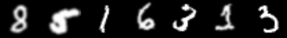
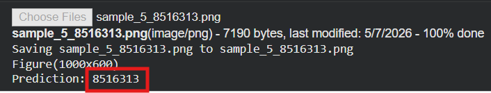
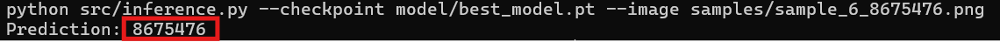
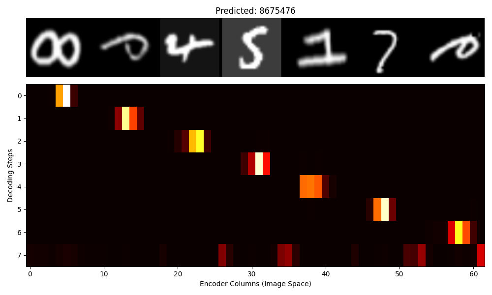

# Digit Sequence Reader

A deep learning model that reads a **variable-length sequence of handwritten digits** from a single stitched image and outputs the correct string of numbers.

> **No bounding boxes. No segmentation. No OpenCV.**
> The model learns where each digit is purely from the training signal.

**Architecture:** `CNN + Bidirectional LSTM` → `Bahdanau Attention` → `LSTM Decoder`  
**Data:** Generated on-the-fly from **EMNIST + QMNIST + USPS** (~307,000 real handwritten digits)  
**Training:** Google Colab T4 GPU · Checkpoints auto-saved to Google Drive  

---

## Example

Below is the model correctly predicting the sequence `8516313` from a stitched image of real handwriting.

**Input image:**  


**Predicted sequence:**  


**Input image:**  


**Predicted sequence:**  


**attention heatmap:**


Each row in the heatmap is one decoding step. The model independently learns to sweep its attention spotlight from left to right across the image as it predicts each digit — with zero explicit supervision on where each digit is located.

---

## How It Works

The model is an **Encoder–Decoder with Attention**. No bounding boxes or segmentation are required, it learns where each digit is purely from training.

**Encoder:** A CNN extracts visual features from the image column by column. A Bidirectional LSTM then enriches each column with context from both its left and right neighbours, producing a sequence of feature vectors that represent the full image.

**Decoder:** An LSTM generates the output one digit at a time. At each step it uses **Bahdanau Attention** to compute a weighted sum over the encoder features, focusing on the region of the image most relevant to the digit it is about to predict. The attention spotlight naturally shifts left to right as decoding progresses.

**Output:** The decoder keeps predicting until it emits an end-of-sequence token, so the output length is fully variable.

---

## Training Data

Training sequences are generated **dynamically on-the-fly** from a combined pool of ~307,000 real handwritten digits (EMNIST, QMNIST, USPS). Each sequence is a random 3–7 digit string assembled by stitching individual digit images together with random gaps or overlaps.

Augmentations (brightness, noise, blur, dropout) are applied per-digit during training only, ramping up gradually over the first 10 epochs so the model stabilizes before seeing heavy degradation. Overlapping characters are introduced separately starting at epoch 5. The source datasets already contain natural geometric variation from real handwriting, so no geometric transforms are added.

---

## Project Structure

```
digit-sequence-reader/
│
├── src/
│   ├── config.py              ← All hyperparameters in one place
│   ├── dataset_aggressive.py  ← EMNIST/QMNIST/USPS loading, augmentation, IterableDataset
│   ├── model.py               ← CNNEncoder, BiLSTMEncoder, Attention, Decoder, Seq2Seq
│   ├── train.py               ← Training loop, checkpointing, metrics CSV
│   ├── evaluate.py            ← Accuracy metrics, confusion matrix, attention heatmaps
│   ├── inference.py           ← Greedy decode any image from the command line
│   └── generate_samples.py    ← Generate sample images from the training distribution
│
├── train_colab.ipynb          ← Colab launcher (mount Drive → clone → train → evaluate)
├── Makefile                   ← Local shortcuts: make infer, make generate
└── requirements.txt
```

---


## Requirements

```
torch>=2.0.0
torchvision>=0.15.0
albumentations>=1.3.0
opencv-python-headless>=4.7.0
numpy
matplotlib
scikit-learn
Pillow
tqdm
```

---

For full technical details on the architecture, attention math, design decisions, and data pipeline see [PROJECT.md](PROJECT.md).
