# Comprehensive System Documentation: Digit Sequence Reader

This repository contains two complete, state-of-the-art architectures designed to read variable-length sequences of handwritten digits from a single stitched image without utilizing object detection or character segmentation.

---

## 🗺️ Architectural Comparison at a Glance

The project showcases a transition from an **autoregressive sequence-to-sequence model** to a **non-autoregressive connectionist temporal classification (CTC) model**. Each architecture is optimized for specific trade-offs:

```mermaid
graph TD
    subgraph Seq2Seq [Autoregressive Seq2Seq Architecture]
        Input1[Input Image: B, 1, 64, W] --> CNN1[2D CNN Encoder]
        CNN1 --> BiLSTM[Bidirectional LSTM Encoder]
        BiLSTM --> Attention[Bahdanau Additive Attention]
        Attention --> Decoder[LSTM Decoder Loop]
        Decoder --> Output1[Output Sequence: e.g., '8516313']
    end

    subgraph CTC [Non-Autoregressive CTC Architecture]
        Input2[Input Image: B, 1, 64, W] --> CNN2[2D CNN Encoder]
        CNN2 --> MeanCollapse[Height Mean Collapse]
        MeanCollapse --> DilatedCNN[1D Dilated Residual CNN]
        DilatedCNN --> Linear[Linear Classifier Head]
        Linear --> DecDecoder[Greedy CTC Decoder]
        DecDecoder --> Output2[Output Sequence: e.g., '8516313']
    end
```



### Key Technical Differences

| Feature | Seq2Seq Branch (`src/seq2seq/`) | CTC Branch (`src/ctc/`) |
| :--- | :--- | :--- |
| **Output Type** | Autoregressive (token-by-token) | Non-autoregressive (parallel frames) |
| **Alignment** | Soft spotlight (Bahdanau Attention) | Latent alignments marginalized via forward-backward |
| **Stopping Criterion** | Learns to predict `<EOS>` token | Collapses consecutive duplicates and removes `BLANK` |
| **Length Extrapolation** | Poor (collapses past $1.2\times$ train max length) | Excellent (extrapolates to $4\times+$ train max length) |
| **Decoding Latency** | $O(L)$ sequential decoding steps | $O(T)$ parallel network execution |
| **Special Tokens** | `<SOS>` (10), `<EOS>` (11), `<PAD>` (12) | `BLANK` (10) |

---

## 🧠 Architectural Deep Dives

---

### 1. Autoregressive Seq2Seq Model (`src/seq2seq/`)

The Seq2Seq model decomposes sequence reading into two main stages: encoding the full image to a memory bank, and decoding character tokens step-by-step.

```
Grayscale Image [B, 1, 64, W]
  │
  ▼
CNNEncoder (3 Conv Blocks, pool 2x2) ───────────► Feature map [B, 128, 8, W//8]
  │                                                               │
  ▼                                                               ▼
Reshape to Seq [B, W//8, 1024]                               Relative Positional Projection
  │                                                               │
  ├───────────────────────────────────────────────────────────────┘
  ▼
BiLSTMEncoder (hidden=256, bidir) ──────────────► encoder_outputs [B, W//8, 512]
  │
  ▼ Projection (Linear + tanh)
Init Decoder State (s0, c0) [B, 256]
  │
  ▼
Decoder Loop (t = 1 ... max_len):
  ├── BahdanauAttention(s_{t-1}, encoder_outputs) ──► context_vector [B, 512]
  ├── Embed(prev_predicted_token) ──────────────────► embedding [B, 64]
  ├── LSTMCell(concat[embedding, context], s_{t-1}) ──► s_t [B, 256]
  └── Linear(s_t) ──────────────────────────────────► logits [B, 13] ──► argmax token
```

#### Detailed Layer walkthrough

1. **CNN Encoder**:
   - Takes grayscale images of shape `[B, 1, 64, W]`.
   - Consists of 3 conv blocks: `Conv2d(kernel=3, padding=1) -> BatchNorm2d -> ReLU -> MaxPool2d(kernel=2, stride=2) -> Dropout2d(p=0.3)`.
   - Channel progression: $1 \to 32 \to 64 \to 128$.
   - Output spatial dimensions: Height is downsampled $64 \to 8$, Width is downsampled $W \to W/8$.
   - Feature maps of shape `[B, 128, 8, T]` (where $T = W/8$) are reshaped to `[B, T, 1024]` representing a sequence of 1024-dimensional column vectors.

2. **Relative Positional Encoding**:
   - To help the Bidirectional LSTM generalize to variable-width sequences, a relative positional signal is added.
   - For each sequence of length $T$, a linear space $p \in [0, 1]^T$ is mapped via `nn.Linear(1, 1024)` and added directly to the CNN features.

3. **BiLSTM Encoder**:
   - Standard BiLSTM with `input_size=1024` and `hidden_size=256`.
   - Outputs a contextual representation of shape `[B, T, 512]`.
   - The final hidden and cell states from the forward and backward directions are concatenated (`[B, 512]`) and projected down to `[B, 256]` via a tanh-activated linear layer to initialize the Decoder LSTM.

4. **Bahdanau Attention**:
   - Additive attention mechanism:
     $$\text{score}_t^i = v^\top \tanh(W s_{t-1} + U h_i)$$
     $$\alpha_t^i = \text{softmax}(\text{score}_t^i)$$
     $$c_t = \sum_{i=1}^T \alpha_t^i h_i$$
   - Projects decoder state $s_{t-1}$ (`[B, 256]`) to `[B, 128]` and encoder outputs $h_i$ (`[B, 512]`) to `[B, 128]`. The attention vector $\alpha_t$ has shape `[B, T]`.

5. **Decoder Step**:
   - Operates in a loop. At step $t$, it takes the previous predicted token (or the ground truth during teacher forcing), passes it through a 64-dimensional embedding, and concatenates it with the attention context vector `[B, 512]` to form a 576-dimensional input.
   - Passes this to an `LSTMCell(hidden=256)`.
   - Out-projected via `nn.Linear(256, 13)` to predict logits over the vocab: 0–9 (digits), `SOS` (10), `EOS` (11), and `PAD` (12).

---

### 2. Parallel CTC Model (`src/ctc/`)

The CTC model avoids autoregressive feedback loops entirely. It operates as a fully convolutional pipeline over time frames, using connectionist temporal classification to marginalize alignments.

```
Grayscale Image [B, 1, 64, W]
  │
  ▼
CNN2DEncoder (4 Conv Blocks, pool 2x2 in blocks 1-3, pool 1x1 in block 4)
  │
  ▼
Feature map: [B, 512, 8, W//8]
  │
  ▼ Height Mean Collapse: mean(dim=2)
Sequence Features: [B, 512, W//8]
  │
  ▼
DilatedCNN1DEncoder (4 Residual blocks, dilations [1, 2, 4, 8])
  │
  ▼
Collapsed Sequence Features: [B, 256, W//8]
  │
  ▼
Linear Classifier Head (Linear(256 -> 11))
  │
  ▼
Logits: [B, W//8, 11] (10 digits + 1 BLANK)
  │
  ├─────────────────────────────────────────┐
  ▼ (Training)                              ▼ (Inference)
CTCLoss(blank=10, zero_infinity=True)    Greedy CTC Decoder (Collapse & clean)
```

#### Detailed Layer walkthrough

1. **CNN 2D Encoder**:
   - Consists of 4 convolutional blocks.
   - Blocks 1, 2, and 3: `Conv2d(kernel=3, padding=1) -> BatchNorm2d -> GELU -> MaxPool2d(2,2) -> Dropout2d(p=0.1)`. Downsamples both height and width.
   - Block 4: `Conv2d -> BatchNorm2d -> GELU -> MaxPool2d(1,1) -> Dropout2d(p=0.1)`. Height and width are unchanged.
   - Output shape: `[B, 512, 8, W//8]`. Height is exactly 8, width is downsampled by 8x.

2. **Height Mean Collapse**:
   - Instead of flattening the spatial feature map, the height dimension (8 pixels) is collapsed by taking the mean: `mean(dim=2)`.
   - This converts a 2D spatial representation into a 1D sequence tensor of shape `[B, 512, T]` (where $T = W/8$), preventing large fully connected layers and retaining translation equivariance.

3. **Dilated CNN 1D Encoder**:
   - Passes the collapsed sequence through 4 `ResidualConv1DBlock` modules with dilations $[1, 2, 4, 8]$.
   - Each block has two convolutional layers with LayerNorm and GELU activations.
   - Dilated convolutions expand the receptive field without pooling, allowing local context aggregation ($\approx 60$ frames) while preventing global sequence information from leaking.
   - Projects feature channels from $512 \to 256$.

4. **Classifier Head & CTC**:
   - Maps each of the $T$ time frames to a probability distribution over 11 classes (digits 0–9 and the `BLANK` token at index 10) using `nn.Linear(256, 11)`.
   - During training, `nn.CTCLoss(blank=10, zero_infinity=True)` is used to calculate the loss over all possible label alignments.

---

## 📈 The Length Extrapolation Challenge

One of the key engineering milestones of this project is resolving the **Length Extrapolation Challenge**.

### Why Seq2Seq Fails
Autoregressive Seq2Seq models depend on predicting an explicit end-of-sequence (`<EOS>`) token. Because the sequence length during training is bounded (e.g., $L \le 12$), the decoder's recurrent states learn a strong length prior:
- The model memorizes that the `<EOS>` token should be emitted after approximately 7 to 12 steps.
- At inference, when presented with a sequence of length 20, the model collapses and prematurely emits `<EOS>`, ignoring the remainder of the image.

### Why CTC Succeeds
The CTC architecture has no autoregressive feedback. It produces frame-level classification outputs that are conditionally independent given the input features. Extrapolation succeeds because:
1. **Translation Equivariance**: The 2D CNN extracts features locally. The weights applied to column 5 are identical to those applied to column 50. The model cannot know "where" in the sequence it is, only what digit is present locally.
2. **Bounded Receptive Field**: The Dilated 1D CNN has a fixed receptive field of $\approx 60$ time frames. It sees enough surrounding pixels to recognize a digit and its boundaries, but is physically unable to see the entire sequence. It cannot learn a global "length prior".
3. **No Stopping Token**: The CTC model classifies every frame. The final output sequence length is determined strictly by the size of the input image and the local features, not by a recurrent state predicting when to stop.

### Empirical Extrapolation Results
Evaluating both architectures trained on $L \le 12$ and tested on longer sequences demonstrates the performance divergence:

| Test Sequence Length | Seq2Seq Accuracy | CTC Accuracy |
| :--- | :--- | :--- |
| **$L = 7$ (In-Distribution)** | $\approx 96\%$ | $\approx 98\%$ |
| **$L = 12$ (Curriculum Max)** | $\approx 91\%$ | $\approx 95\%$ |
| **$L = 20$ (1.7x Extrapolation)**| $< 10\%$ (Catastrophic collapse) | $\approx 85\%$ (Graceful) |
| **$L = 30$ (2.5x Extrapolation)**| $0\%$ | $\approx 65\%$ (Graceful) |
| **$L = 50$ (4.2x Extrapolation)**| $0\%$ | $\approx 40\%$ (Graceful) |

---

## 📊 Data Generation & Augmentation Pipeline

Training sequences are synthesized dynamically on-the-fly using PyTorch's `IterableDataset`, keeping base RAM usage low ($\approx 1.5$ GB) while ensuring the model never sees the exact same image sequence twice.

### Multi-Dataset Digit Bank
Individual digit images are drawn from a combined pool of three sources:
1. **EMNIST Digits**: $\approx 240,000$ images.
2. **QMNIST**: $\approx 60,000$ images.
3. **USPS**: $\approx 7,200$ images (bilinearly resized to $28\times28$).

This provides a diverse source pool of $\approx 307,000$ handwritten digits.

### Dynamic Sequence Construction
For each sequence, the following steps are performed:
1. A sequence length $L$ is sampled from the current epoch's curriculum range.
2. $L$ digit classes are chosen at random (e.g., `[3, 8, 1, 4]`).
3. For each digit, a random image is pulled from the digit bank.
4. Training-only augmentations are applied to each digit independently (rather than the full image).
5. **Spacing and Overlaps**:
   - $80\%$ chance: A random blank gap ($0$ to $12$ pixels) is inserted.
   - $20\%$ chance (starting at epoch 5): Consecutive digits are overlapped by up to $8$ pixels (by trimming the trailing edge of the previous digit tensor).
6. The digit tensors are concatenated horizontally into a single image of shape `[1, 64, W]`.

```
┌──────────┐      ┌──────────┐      ┌──────────┐
│ Digit 3  │ ───► │ Digit 8  │ ───► │ Digit 1  │
│ [64x64]  │      │ [64x64]  │      │ [64x64]  │
└──────────┘      └──────────┘      └──────────┘
      │                 │                 │
      ▼ (Gap: 4px)      ▼ (Overlap: 6px)  ▼ (Gap: 2px)
┌──────────────────────────────────────────────┐
│  3      8 1                                  │  ===> Concatenated Image [1, 64, W]
└──────────────────────────────────────────────┘
```

> [!IMPORTANT]
> **The CTC Width Guarantee**:
> PyTorch's `nn.CTCLoss` requires the input sequence length $T$ to be greater than or equal to the target sequence length $L$ ($T \ge L$). Because our CNN downsamples the width by 8x, the final time steps $T = W/8$. To guarantee $T \ge 2L$ (which is necessary to allow space for intermediate `BLANK` tokens), the data generator enforces a strict minimum width:
> $$W \ge \max(64, L \times 16)$$
> The width is then snapped to the next multiple of 8.

### Curriculum Learning Schedule
To stabilize early training, the pipeline follows a strict curriculum:
- **Epochs 1-5**: Zero character overlapping. Augmentation intensity (brightness shifts, noise, dropout) scales linearly from $0\% \to 50\%$. Max sequence length is restricted to $7$.
- **Epochs 5-10**: Overlap probability scales linearly from $0\% \to 10\%$. Augmentation intensity reaches $100\%$ by epoch 10.
- **Epochs 11-30**: Max sequence length ramps up linearly from $7$ to $12$.

```
Epoch 1                       Epoch 5                      Epoch 10              Epoch 30
  ├──────────────────────────────┼────────────────────────────┼─────────────────────┤
  ▲                              ▲                            ▲                     ▲
  Augmentation: 0%               Augmentation: 50%            Augmentation: 100%    Augmentation: 100%
  Overlap Prob: 0%               Overlap Prob: 0% -> 10%      Overlap Prob: 10%     Overlap Prob: 10%
  Max Length: 7                  Max Length: 7                Max Length: 7         Max Length: 12
```

---

## 📁 Repository Reference

The codebase is organized into two main directory trees corresponding to the two architectures, with utility tools located at the project root.

```
digit-sequence-reader/
│
├── src/
│   ├── seq2seq/                 # Autoregressive Seq2Seq Branch
│   │   ├── config.py            # Hyperparameters and paths for Seq2Seq
│   │   ├── dataset.py           # Legacy map-style dataset (MNIST only)
│   │   ├── dataset_aggressive.py# Production IterableDataset with EMNIST/QMNIST/USPS
│   │   ├── model.py             # CNNEncoder, BiLSTMEncoder, BahdanauAttention, Decoder, Seq2Seq
│   │   ├── train.py             # Seq2Seq training loop and evaluation
│   │   ├── evaluate.py          # Seq2Seq validation, confusion matrices, and heatmaps
│   │   ├── inference.py         # Seq2Seq greedy decode CLI
│   │   └── generate_samples.py  # Utility to save sample Seq2Seq images
│   │
│   └── ctc/                     # Non-Autoregressive CTC Branch
│       ├── config.py            # Hyperparameters, paths, and receptive field settings for CTC
│       ├── dataset.py           # Production CTC IterableDataset, collate, and width guarantees
│       ├── model.py             # CNN2DEncoder, ResidualConv1DBlock, DilatedCNN1DEncoder, CRNN_CTC
│       ├── train.py             # CTC training loop (utilizing free logits optimization)
│       ├── evaluate_extrapolation.py # Benchmarks model accuracy on unseen sequence lengths
│       ├── inference.py         # CTC greedy decode CLI with per-frame argmax plot
│       ├── generate_one.py      # Generates a single sequence of a specific length
│       └── generate_samples.py  # Utility to save sample CTC images
│
├── docs/                        # Supplemental markdown documentation
├── train_colab.ipynb            # Google Colab notebook for Seq2Seq training
├── train_colab_ctc.ipynb        # Google Colab notebook for CTC training
├── Makefile                     # CLI shortcuts for both pipelines
└── requirements.txt             # Python project dependencies
```

---

## 🛠️ Step-by-Step Execution Guide

### 1. Installation

Install all required dependencies using `pip`:
```bash
pip install -r requirements.txt
```

---

### 2. Running the CTC Pipeline

#### Training
To train the CTC model from scratch:
```bash
make ctc-train
```
This runs `src/ctc/train.py` and saves checkpoints to `./model/checkpoints_ctc/best_ctc.pt`. It automatically updates the curriculum learning parameters at the start of each epoch by recreating the training data loader.

To resume training from an existing checkpoint:
```bash
python -m src.ctc.train --drive_path ./model --resume ./model/checkpoints_ctc/best_ctc.pt
```

#### Inference
To run inference on a test image with visual plots:
```bash
make ctc-infer
```
This defaults to `samples/test.png`. You can override the image and supply explicit ground truth to compute Character Error Rate (CER):
```bash
make ctc-infer IMAGE=samples/sample_L7_1234567.png
```
Or with explicit ground truth overrides:
```bash
make ctc-infer IMAGE=my_custom_image.png GT=987654
```

> [!NOTE]
> When `--visualize` is active, the inference script displays:
> 1. The original image labeled with the model's prediction.
> 2. A per-frame argmax plot showing which character index (0-10, where 10 is `BLANK`) was predicted at each temporal step. Look for vertical spikes to `10` showing the boundaries between characters.

#### Length Extrapolation Benchmark
To evaluate the CTC model's ability to extrapolate to unseen lengths (e.g., testing on lengths $1 \to 50$ when trained on $\le 12$):
```bash
make ctc-eval-extrap
```
This generates 200 samples for each target length, evaluates predictions, and outputs:
- A JSON summary of accuracy and CER metrics per length.
- A dual-panel chart (`ctc_length_extrapolation.png`) plotting Sequence Accuracy and CER against length, with a red line indicating the training boundary.

---

### 3. Running the Seq2Seq Pipeline

#### Training
To train the Seq2Seq model:
```bash
python -m src.seq2seq.train --drive_path ./model
```
Checkpoints are saved to `./model/checkpoints/best_model.pt`.

#### Inference
To run inference on an image and plot the attention spotlight:
```bash
make infer
```
By default, this evaluates `samples/test.png` and generates an attention heatmap showing how the decoder shifts its focus from left to right as it emits each digit.

---

## 🛠️ Performance Diagnostic Guide

If you encounter issues during training or evaluation, consult this quick reference:

> [!WARNING]
> **Common Failure Modes**
> 
> * **CTC Loss goes to `NaN` or `Inf`**:
>   - *Cause*: The input sequence length $T$ is shorter than the target sequence length $L$ ($T < L$), which prevents CTC from finding a valid alignment.
>   - *Fix*: Check that the `collate_fn` in `src/ctc/dataset.py` is padding images correctly, and verify that the width guarantee formula `W >= max(64, L * 16)` is active in `make_sequence()`.
> 
> * **Catastrophic Accuracy Drop at Test Lengths $L > 12$ (CTC)**:
>   - *Cause*: The model has leaked positional information or learned a length prior.
>   - *Fix*: Ensure you are not using absolute positional embeddings in the CTC model. Verify that the 1D dilated CNN's receptive field is strictly bounded (i.e., dilations are $[1, 2, 4, 8]$ and kernel size is 3).
> 
> * **Seq2Seq Attention Map does not sweep Left-to-Right**:
>   - *Cause*: Underfitting or improper teacher forcing.
>   - *Fix*: Verify the model has trained for at least 15 epochs. Check that the teacher forcing ratio is set to $0.5$ during training and is strictly disabled ($0.0$) during validation.
> 
> * **Colab session crashes or runs out of RAM**:
>   - *Cause*: The data generator is pre-generating too many sequences.
>   - *Fix*: Ensure you are using `InfiniteSequenceDataset` (which generates samples lazily via python generators) rather than the legacy `SequenceDataset` (which pre-caches images in memory).
